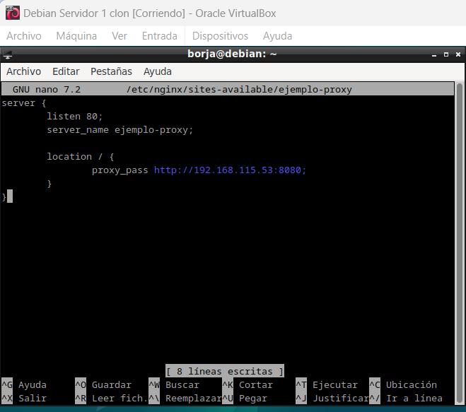
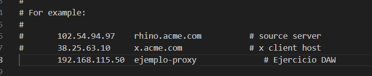

# Práctica 2.3 – Proxy inverso con Nginx

### Configuración

Para que todo quede más diferenciado y os quede más claro que la petición está pasando por el proxy inverso y llega al servidor web destino, vamos a hacer que cada uno de los servidores escuche las peticiones en un puerto distinto.

1.- En primer lugar, debéis cambiar el nombre que tuviera vuestra web por el de webserver, ello implica:

- Cambiar el nombre del archivo de configuración de sitios disponibles par Nginx

```
sudo mv /etc/nginx/sites-available/mi_sitio /etc/nginx/sites-available/webserver
```
        

- Cambiar el nombre del sitio web dentro de este archivo de configuración donde haga falta

- No os olvidéis de eliminar el link simbólico antiguo con el comando unlink nombre_del_link dentro de la carpeta sites-enabled y crear el nuevo para el nuevo nombre de archivo.

```
sudo unlink /etc/nginx/sites-enabled/mi_sitio

sudo ln -s /etc/nginx/sites-available/webserver /etc/nginx/sites-enabled/
```

2.- En el archivo de configuración del sitio web, en lugar de hacer que el servidor escuche en el puerto 80, cambiadlo al 8080.


3.- Reiniciar Nginx

### Nginx proxy inverso

Ahora en la máquina clonada debemos crear el proxy inverso:

Crear un archivo de configuración en sites-available con el nombre ejemplo-proxy (o el que tuvieráis vosotros)

```
sudo nano /etc/nginx/sites-available/proxy-ejemplo
```

Este archivo de configuración será más simple, tendrá la siguiente forma



A continuación crear el enlace simbólico para el proxy inverso:

```
ln -s /etc/nginx/sites-available/ejemplo-proxy /etc/nginx/sites-enabled/
```

Reiniciar Nginx en el servidor proxy:

```
systemctl restart nginx
```

Para terminar, no olvidemos modificar el archivo host de nuestra máquina física para acceder al proxy inverso.

