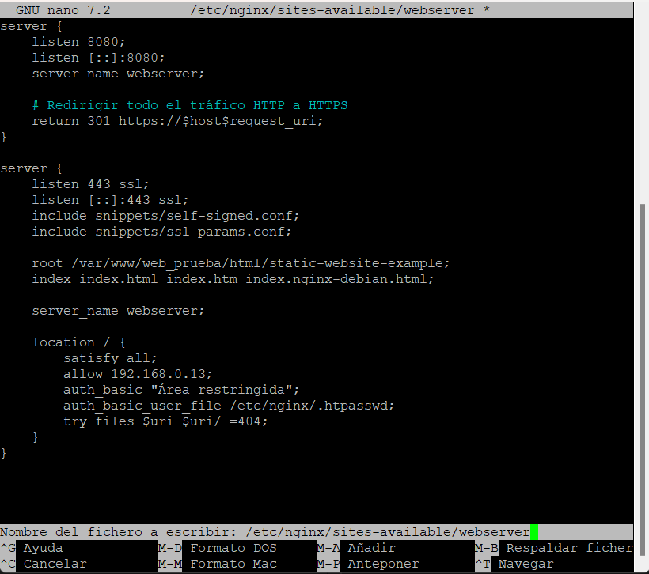

# Instalación y configuración de un servidor web Nginx

Primero de todo, actualizaremos e instalaremos el paquete de Nginx:

```
sudo apt update
sudo apt install nginx
```


### Comprobación de Nginx

Comprobaremos que Nginx está funcionando:

```
systemctl status nginx
```


### Creación de carpetas del sitio web

Ahora vamos a crear las carpetas que contendrán todos los archivos del sitio web. Accedemos a la carpeta /var/www y creamos la carpeta de nuestro dominio:

```
sudo mkdir -p /var/www/nombre_web/html`
```

Dentro de la carpeta /html, tendremos que clonar el repositorio https://github.com/cloudacademy/static-website-example.

Para poder hacerlo, debemos tener ya instalado Git.


Ahora haremos que el propietario de esta carpeta y todo lo que haya dentro sea el usuario www-data, que normalmente es el usuario del servicio web:

```
sudo chown -R www-data:www-data /var/www/nombre_web/html
```

Le daremos permisos para que no nos dé un error de acceso no autorizado al entrar en el sitio web:

```
sudo chmod -R 755 /var/www/nombre_web
```


### Comprobación del servidor

Para comprobar que el servidor está funcionando y sirviendo páginas correctamente, accedemos desde nuestro cliente a:

```
http://IP_máquina_virtual
```

Deberá aparecer algo así:


### Configuración del bloque de servidor

Para que Nginx presente el contenido de nuestra web, es necesario crear un bloque de servidor con las directivas correctas. En vez de modificar el archivo de configuración predeterminado directamente, crearemos uno nuevo en **/etc/nginx/sites-available/nombre_web:**

Con el comando:

```
sudo nano /etc/nginx/sites-available/vuestro_dominio
```

En el editor de configuración pondremos lo siguiente:


(Donde la ruta root será la carpeta donde clonamos el repositorio anterior en la que se encuentra nuestro archivo index.html).

Y crearemos un archivo simbólico entre este archivo y el de sitios que están habilitados, para que se dé de alta automáticamente:

```
sudo ln -s /etc/nginx/sites-available/nombre_web /etc/nginx/sites-enabled/
```

Reiniciamos el servidor para aplicar la configuración:

```
sudo systemctl restart nginx
```

### Comprobación del correcto funcionamiento

Como aún no poseemos un servidor DNS que traduzca los nombres a IPs, debemos hacerlo de forma manual. Vamos a editar el archivo /etc/hosts de nuestra **máquina anfitriona** para que asocie la IP de la máquina virtual a nuestro server_name.

En Windows acceder a:

```
C:\Windows\System32\drivers\etc\hosts
```

Y deberemos añadirle la línea:

```
192.168.X.X nombre_web
```

Donde debéis sustituir la IP por la que tenga vuestra máquina virtual.


Podemos comprobar que funcione haciendo ping.


Desde el archivo **/var/log/nginx/access.log** de nuestra máquina virtual podemos consultar las peticiones a nuestra web.


Desde el archivo **/var/log/nginx/error.log** de nuestra máquina virtual podemos consultar cualquier error que se haya registrado.


### Transferir archivos desde la máquina local a la máquina virtual mediante FTP

En primer lugar, lo instalaremos desde los repositorios:

```
sudo apt-get update
sudo apt-get install vsftpd
```

Ahora vamos a crear una carpeta en nuestro home en Debian:

```
mkdir /home/nombre_usuario/ftp
```

Y ahora crearemos los certificados de seguridad necesarios para aportar la capa de cifrado a nuestra conexión (algo parecido a HTTPS):

```
sudo openssl req -x509 -nodes -days 365 -newkey rsa:2048 -keyout /etc/ssl/private/vsftpd.pem -out /etc/ssl/private/vsftpd.pem
```


Y una vez realizados estos pasos, procedemos a realizar la configuración de vsftpd propiamente dicha:

```
sudo nano /etc/vsftpd.conf
```

Ahora debemos eliminar las siguientes líneas:


Y seguidamente añadiremos las siguientes líneas:

```
rsa_cert_file=/etc/ssl/private/vsftpd.pem
rsa_private_key_file=/etc/ssl/private/vsftpd.pem
ssl_enable=YES
allow_anon_ssl=NO
force_local_data_ssl=YES
force_local_logins_ssl=YES
ssl_tlsv1=YES
ssl_sslv2=NO
ssl_sslv3=NO
require_ssl_reuse=NO
ssl_ciphers=HIGH
local_root=/home/nombre_usuario/ftp
```


Tras guardar los cambios, reiniciamos el servicio para que coja la nueva configuración:

```
sudo systemctl restart --now vsftpd
```

Ya podemos acceder a nuestro servidor mediante un cliente FTP como por ejemplo Filezilla. Vamos a conectarnos mediante SFTP. Debemos introducir los datos de nuestra máquina y el puerto 22.


Al pulsar conexión rápida, nos aparecerá un aviso que debemos aceptar.

A continuación, buscaremos el archivo que queremos subir a nuestro servidor en la pestaña de la izquierda; en este caso, enviaré un archivo .zip llamado “PruebaDAW”.

Para subirlo pulsamos clic derecho y “Subir”.


### Añadir certificados SSL y acceder mediante HTTPS

Lo primero será generar los certificados:

```
sudo openssl req -x509 -nodes -days 365 -newkey rsa:2048 -keyout /etc/ssl/private/nginx-selfsigned.key -out /etc/ssl/certs/nginx-selfsigned.crt
```


Crear un grupo Diffie-Hellman:

```
sudo openssl dhparam -out /etc/nginx/dhparam.pem 2048
```


Crear una configuración para SSL:

```
sudo nano /etc/nginx/snippets/self-signed.conf
```

Y poner lo siguiente:

```
ssl_certificate /etc/ssl/certs/nginx-selfsigned.crt;
ssl_certificate_key /etc/ssl/private/nginx-selfsigned.key;
```


Crear una configuración para parámetros SSL:

```
sudo nano /etc/nginx/snippets/ssl-params.conf
```

Y añadir lo siguiente:

```
Copiar código
ssl_protocols TLSv1.2 TLSv1.3;
ssl_prefer_server_ciphers on;
ssl_ciphers 'ECDHE-ECDSA-AES256-GCM-SHA384:ECDHE-RSA-AES256-GCM-SHA384:ECDHE-ECDSA-AES256-SHA384:ECDHE-RSA-AES256-SHA384:ECDHE-ECDSA-AES128-GCM-SHA256:ECDHE-RSA-AES128-GCM-SHA256:ECDHE-ECDSA-AES128-SHA256:ECDHE-RSA-AES128-SHA256';
ssl_dhparam /etc/nginx/dhparam.pem;
ssl_session_timeout 1d;
ssl_session_cache shared:SSL:50m;
ssl_session_tickets off;
ssl_stapling on;
ssl_stapling_verify on;
resolver 8.8.8.8 8.8.4.4 valid=300s;
resolver_timeout 5s;
add_header X-Content-Type-Options nosniff;
add_header X-Frame-Options DENY;
add_header X-XSS-Protection "1; mode=block";
```


Editar el archivo de configuración del sitio

```
sudo nano /etc/nginx/sites-available/nombre_web
```


Habilitar la nueva configuración y reiniciar Nginx.
Crear el enlace simbólico (si aún no está hecho):

```
sudo ln -s /etc/nginx/sites-available/nombre_web /etc/nginx/sites-enabled/
```

Reiniciar Nginx:

```
sudo systemctl restart nginx
```

Ahora ya podremos acceder a nuestra web buscando:

```
https://nombre_web
```

o

```
http://nombre_web
```


### Paquetes necesarios

Para esta práctica podemos utilizar la herramienta openssl para crear las contraseñas.

En primer lugar debemos comprobar si el paquete está instalado:

```
dpkg -l | grep openssl
```

Y si no lo estuviera, instalarlo.

### Creación de usuarios y contraseñas para el acceso web
Creamos un archivo oculto llamado “.htpasswd” en el directorio de configuración /etc/nginx donde guardar nuestros usuarios y contraseñas:

```
sudo sh -c "echo -n 'vuestro_nombre:' >> /etc/nginx/.htpasswd"
```
Ahora crearemos un pasword cifrado para el usuario:

```
sudo sh -c "openssl passwd -apr1 >> /etc/nginx/.htpasswd"
```

Este proceso se podrá repetir para tantos usuarios como haga falta.

Crea dos usuarios, uno con tu nombre y otro con tu primer apellido
Comprueba que el usuario y la contraseña aparecen cifrados en el fichero:
```
cat /etc/nginx/.htpasswd
```


### Configurando el servidor Nginx para usar autenticación básica

Editaremos la configuración del server block sobre el cual queremos aplicar la restricción de acceso.

```
sudo nano /etc/nginx/sites-available/nombre_web
```
Utilizaremos la directiva `auth_basic` dentro del location y le pondremos el nombre a nuestro dominio que será mostrado al usuario al solicitar las credenciales. Por último, configuramos Nginx para que utilice el fichero que previamente hemos creado con la directiva `auth_basic_user_file`:


Una vez terminada la configuración, reiniciamos el servicio.
```
sudo systemctl restart nginx
```

### Comprobación 1

Comprueba desde tu máquina física/anfitrión que puedes acceder a http://nombre-sitio-web y que se te solicita autenticación


### Comprobación 2

Comprueba que si decides cancelar la autenticación, se te negará el acceso al sitio con un error. ¿Qué error es?


### Tarea 1

Intenta entrar primero con un usuario erróneo y luego con otro correcto. Puedes ver todos los sucesos y registros en los logs access.log y error.log

Adjunta una captura de pantalla de los logs donde se vea que intentas entrar primero con un usuario inválido y con otro válido. Indica dónde podemos ver los errores de usuario inválido o no encontrado, así como donde podemos ver el número de error que os aparecía antes

Usuario inválido:

access.log

error.log:


Usuario válido:

access.log

error.log:
No hay error ya que el usuario es válido.

### Tarea 2

Borra las dos líneas que hacen referencia a la autenticación básica en el location del directorio raíz. Tras ello, añade un nuevo location debajo con la autenticación básica para el archivo/sección contact.html únicamente.


### Combinación de la autenticación básica con la restricción de acceso por IP

### Tarea 1

Configura Nginx para que no deje acceder con la IP de la máquina anfitriona al directorio raíz de una de tus dos webs. Modifica su server block o archivo de configuración. Comprueba como se deniega el acceso:


Al intentar acceder nos encontramos con error



error.log:


### Tarea 2

Configura Nginx para que desde tu máquina anfitriona se tenga que tener tanto una IP válida como un usuario válido, ambas cosas a la vez, y comprueba que sí puede acceder sin problemas


